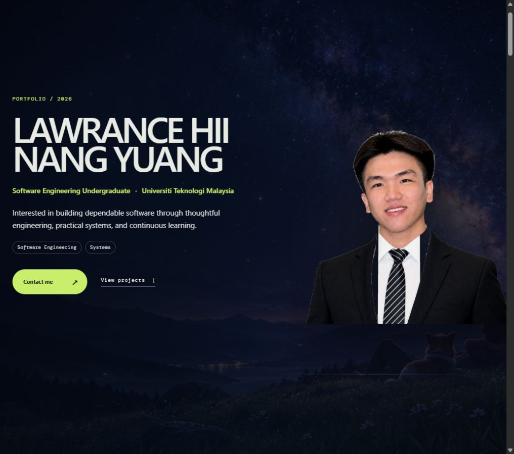

# Lawrance Hii — Personal Portfolio

A responsive portfolio website for presenting my software engineering journey, projects, competitions, education, skills, and independent learning.

[View the live website](https://self-introduction-website-pi.vercel.app/)



## Highlights

- Responsive single-page experience for desktop and mobile
- Project and competition galleries with detail views
- Education and self-learning timelines
- Content Studio for updating portfolio content without changing source files
- Draft history with undo, redo, preview, save, and discard controls
- Section-level visibility controls for preparing different portfolio views
- Secure Host Mode backed by server-validated sessions
- Email-based password recovery through Supabase Auth
- Reduced-motion support and keyboard-accessible controls

## Technology

| Area | Implementation |
| --- | --- |
| Frontend | React, Vite, modern CSS |
| Content | React context with Supabase persistence |
| Authentication | Supabase Auth with HTTP-only session cookies |
| Server endpoints | Vercel Functions |
| Hosting | Vercel |

## Architecture

Visitors read the published portfolio directly from Supabase. Editing is available only after a server-verified Host session. Protected changes are sent to `/api/content`, where the session and request origin are checked before the content record is updated.

The editing interface is an overlay, so entering Host Mode does not change the public page layout. Preview Mode temporarily hides editing controls while preserving the current draft and history.

See [docs/ARCHITECTURE.md](docs/ARCHITECTURE.md) for a more detailed walkthrough.

## Run locally

Requirements: Node.js 20+ and pnpm.

```bash
pnpm install
cp .env.example .env.local
pnpm dev
```

Then open the local URL printed by Vite.

Create a production build with:

```bash
pnpm build
```

## Environment variables

Copy `.env.example` to `.env.local` and provide the Supabase project values:

```env
VITE_SUPABASE_URL=
VITE_SUPABASE_PUBLISHABLE_KEY=
SUPABASE_URL=
SUPABASE_PUBLISHABLE_KEY=
```

The browser uses only the publishable Supabase configuration. Host credentials and session tokens are never stored in source code. Server functions keep authenticated sessions in secure, HTTP-only cookies.

## Project structure

```text
api/                 Vercel functions for Host authentication and saving
artifacts/           Selected README screenshots
docs/                Architecture and implementation notes
src/
  assets/            Portfolio images and local media
  components/        Public sections and application UI
  context/           Portfolio state, drafts, and history
  data/              Default content and data shape
  editor/            Host Mode editing controls
  services/          Content persistence
  styles/            Global, responsive, and component styles
  utils/             Shared link helpers
```

## Main workflows

### Visitor

Browse the portfolio, expand project or learning collections, open gallery details, and use the contact links.

### Host

Sign in through **Host Access**, open **Content Studio**, edit content, preview the draft, and save it. The studio can be moved around the desktop viewport and becomes a bottom sheet on smaller screens.

## Security notes

- Content writes require an authenticated server session.
- Session cookies are `HttpOnly`, `Secure`, and `SameSite=Strict`.
- Write requests are restricted to the same origin.
- Login and password-recovery endpoints include basic rate limiting.
- Password recovery responses do not reveal whether an account exists.
- Passwords and recovery tokens are not stored in frontend code or browser storage.

## Current status

The portfolio foundation and Host editing workflow are complete. Project and competition entries are designed to be replaced with final case studies as they are ready for publication.
